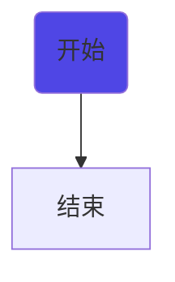

# 测试

随着人工智能技术的不断发展，本项目旨在赋能开发者。这不是配置问题，而是网络问题。

流程是读取文件 → 解析 AST → 生成报告。工具只扫描仓库文件——不处理依赖。

✅ 扫描成功,共698个文件

如图 3-1 所示，扫描耗时稳定。

```mermaid
flowchart TD
  A(开始) --> B[结束]
  style A fill:#4f46e5
```

图 3-1 扫描流程

| a | b |
|---|---|
| 1 | 2 |
